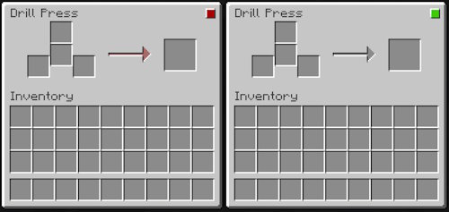

<h1 style="text-align:center;">Mag-Mudge's Ecosystem</h1>

   
<!--
  <a href="https://discord.gg/##++##" title="Mag-Mudge's Ecosystem at Discord" style="margin:0 1em 0 0;">Discord</a>
  <a href="https://www.curseforge.com/minecraft/mc-mods/##++##cfmodname##++####" title="The Minecraft Mod Mag-Mudge's Ecosystem at Curseforge" style="margin:0 1em 0 0;">Curseforge</a>
  <a href="https://modrinth.com/mod/##++##mrmodname##++##" title="The Minecraft Mod Mag-Mudge's Ecosystem at Modrinth">Modrinth</a>
-->

## Dependency
### Requires
- Fabric API
### Includes
- TerraformersMC Wood API
### Optional
- Roughly Enough Items Fabric (REI)

## Short overview
Short overview of the mod's features:
- new advancements
- loot table modifications
- new ores and raw materials:  
  latex, sulfur, tin
- new trees:  
  mediterranean cypress, firethorn, privet, sloe
- new workbenches and similar blocks:  
  drill press, jaw crusher, latex collector, milling machine, table saw
- new tools:  
  box end wrench, cross head screwdriver, steel axe, steel hoe, steel pickaxe, steel shovel, steel sword, voltmeter
- new alloys and other mixed products:  
  bronze, luminous metal, plastic, red alloy, steel
- crushed "classic" materials
- new intermediates:  
  diamond circular saw blade, drill bit, milling cutter, milling machine base, milling machine turret, red alloy cable, plates, wires
- new blocks:  
  block variants, parquet (herringbone), chains, doors, isolated doors, secret doors, secret trapdoors, pressure trapdoors, trapdoors, wired blocks, repeating blocks, signal randomizer blocks, wired chains, wired fences, chimneys & redstone chimneys, statues, twin wire mesh fences, wire meshs, tables, wired tables
- new lighting blocks:  
  (soul) lanterns, wall (soul) lanterns, redstone lanterns, luminous panels & redstone-luminous panels, wall/ceiling lamps & redstone wall/ceiling lamps, floor lamps & redstone floor lamps, table lamps & redstone table lamps, chandeliers & redstone chandeliers, sconces & redstone sconces
- new food:  
  green prickly pear, red prickly pear, sloe berries
- new villager professions:  
  forest botanist, quarryman

## World generation
The mod changes the world generation as described below.

### New ore
The following new ores are generated:
- Sulfure (Overworld, Nether)
- Tin (Overworld)

### New tree
The following new trees are generated:
- Mediterranean cypress (flower forest, plains, savanna, savanna plateau, sunflower plains, wooded badlands)
- Privet (flower forest, meadow, plains, sunflower plains)
- Sloe (birch forest, flower forest, forest, plains, snowy plains, sunflower plains, swamps)

## Loot table modifications
The Minecraft loot tables listed below are extended by the mod.

### Chests
- village_armorer
- village_temple
- village_toolsmith
- village_weaponsmith

### Entities
- creeper
- drowned
- skeleton
- zombie

### Plants
- cactus

## Advancements
The mod adds a new advancements tree. 

## Recipe conflicts
There are two recipes for the jaw crusher. One uses only standard Minecraft blocks and the crafting is done on the crafting table.
This recipe could theoretically lead to a conflict with another mod or a future Minecraft recipe. However, no conflict has been reported so far.

For all other recipes, at least one of the following applies:
- At least one mod-specific block / item is required.
- The crafting can only be done on a mod-specific "workbench".

This eliminates recipe conflicts with other mods or future Minecraft recipes.

## Workbenches and similar blocks
### Drill press
Drill presses must be dismantled with a stone pickaxe or higher in order to drop as an item. Otherwise it will be destroyed.

#### Usage
Various blocks can be drilled through in the drill press and fitted with red-alloy cables, for example.

The duration of the crafting process varies from recipe to recipe and depends primarily on the hardness of the blocks used. Crafting with obsidian, for example, takes longer than with wood.

The drill press must receive a redstone signal in order to be used. Without a redstone signal, the GUI of the drill press can be opened and filled, but nothing can be crafted.
If the redstone signal is interrupted, ongoing crafting processes stop and are reset.
Whether a drill press is receiving a redstone signal is indicated by a red/green light on the block and in the GUI.

#### GUI / Drill press recipes
The GUI of the drill press:  

> left: Drill press receives no energy (redstone signal). The lamp at the top right is red. Crafting is not possible.  
> right: Drill press receives a redstone signal. The lamp at the top right is green. Crafting is possible.

The following table structure is used for drill press recipes in this document:

|                 |                  |                 | 
|-----------------|------------------|-----------------|
| -               | upper item slot  | -               |
| -               | middle item slot | -               |
| left item slot  | -                | right item slot |

#### Crafting
The drill press is crafted from the following items:
* 2x buttons
* drill bit
* 4x steel blocks
* 2x wooden planks

Place of production:
* Crafting Table

##### Recipe

|              |             |              |
|--------------|-------------|--------------|
| button       | steel block | button       | 
| wooden plank | drill bit   | wooden plank |
| steel block  | steel block | steel block  |

### Jaw crusher
Jaw crushers must be dismantled with an iron pickaxe or higher in order to drop as an item. Otherwise it will be destroyed.

#### Usage
The jaw crusher crushes e.g. ingots, diamonds, sulphur, coal or bones.
It also serves as a quarryman's job site block.

The duration of the crushing process varies from recipe to recipe.

The crushed materials can then be used to produce other items. Or several crushed materials can be mixed together and melted to produce an alloy. This can then be further processed.

Crushed diamond is required, for example, for the production of a diamond circular saw blade.
Crushed sulphur is needed for the rubber-sulphur-mixture from which plastic can be produced.
Crushed copper and crushed tin are required for the raw red alloy mixture, from which red alloy can be produced in the furnace.

#### Crafting
The jaw crusher is crafted from the following items:
* iron ingot
* lever
* 4x obsidian
* sticky piston
* stone
* redstone block

Place of production:
* Crafting Table

##### Recipes

|          |            |                |
|----------|------------|----------------|
| obsidian | iron ingot | lever          | 
| obsidian | iron ingot | piston         |
| obsidian | obsidian   | redstone block |

|          |             |                |
|----------|-------------|----------------|
| obsidian | steel ingot | lever          | 
| obsidian | steel ingot | piston         |
| obsidian | obsidian    | redstone block |

### Latex collector
#### Usage
The latex collector must be attached to trees. It must then be fitted with a bucket. This then fills up with latex after a while.
It also serves as a forest botanist's job site block.

It should be noted that some tree species do not provide latex (efficiency: 0%). Other tree species fill the bucket with latex at different rates (125%, 100%, 80%, 40%, 20%).
With these tree species, the latex collector should be placed in the middle of the trunk. No latex is collected at the base or in the crown of the tree.

When the latex collector is opened, the efficiency of the collector is displayed in the GUI.

> top left: The tree base is marked in red. If the latex collector is attached here, it will not provide any latex. / 
> top right: Latex collector equipped with a bucket that is full of latex.  
> bottom: GUI indicates the efficiency of the Latex Collector (left: 100%, right: 20%)

#### Crafting
The latex collector is crafted from the following items:
* 3x steel nuggets
* 3x sticks

Place of production:
* Crafting Table

##### Recipe

|              |              |              |
|--------------|--------------|--------------|
| steel nugget |              | steel nugget | 
| sticks       | steel nugget | sticks       |
|              | sticks       |              |

### Milling machine
Milling machines must be dismantled with a stone pickaxe or higher in order to drop as an item. Otherwise it will be destroyed.

#### Usage
Different objects can be combined in the milling machine to create a new object. Or blocks can be decorated with ornaments etc.

#### GUI / Milling machine recipes
The GUI of the milling machine:  

> Milling machine GUI: E.g. different blocks can be crafted from two stones. The arrangement of the source blocks does not matter.

With the milling machine it is quite possible to craft different blocks from the same source blocks - in contrast to the crafting table.

The GUI contains a block selection menu that is empty. The menu is populated with blocks that can be crafted from that particular material, only if one or more blocks are inserted into its input slots.
It does not matter how the source blocks are arranged. If different source blocks are required, it does not matter in which order they are arranged.

#### Crafting
The milling machine is crafted from the following items:
* milling machine base
* milling machine turret

Place of production:
* Inventory (2x2)
* Crafting Table

##### Recipe

|                        |
|------------------------|
| milling machine turret | 
| milling machine base   |

### Table saw
Table saws must be dismantled with a stone pickaxe or higher in order to drop as an item. Otherwise it will be destroyed.

#### Usage
The table saw has a diamond circular saw blade and is therefore more precise to work with than the stone cutter. Otherwise, it is used in the same way as the stone cutter.

Due to the more precise working method, the table saw can be used to craft e.g. 5 red alloy plates from one red alloy ingot. With the stone cutter, on the other hand, only 3 plates can be obtained from the ingot.

#### GUI / Table saw recipes
The GUI of the milling machine:  

> Table saw GUI: E.g. different blocks can be crafted from a stone block.

With the table saw it is quite possible to craft different blocks from the same source blocks - in contrast to the crafting table.

The GUI contains a block selection menu that is empty. The menu is populated with blocks that can be crafted from that particular material, only if a block is inserted into its input.

#### Crafting
The table saw is crafted from the following items:
* diamond circular saw blade
* 2x wooden planks
* steel block

Place of production:
* Crafting Table

##### Recipe

|              |                            |              |
|--------------|----------------------------|--------------|
|              | diamond circular saw blade |              |
| wooden plank | steel block                | wooden plank |

## Tools
### Box end wrench
#### Usage
The box end wrench can be used on the blocks listed below.
Please refer to the respective block description to find out what effect / benefit the box end wrench has when used on that block.

- Pressure trapdoors
- Repeating blocks
- Signal randomizer blocks
- Entity detector blocks

#### Crafting
The box end wrench is crafted from the following items:
* steel bar
* steel plate

Place of production:
* Drill press

##### Recipe

|           |             |   | 
|-----------|-------------|---|
| -         |             | - |
| -         | steel plate | - |
| steel bar | -           |   |

### Cross head screwdriver
#### Usage
The cross head screwdriver can be used on the blocks listed below.
Please refer to the respective block description to find out what effect / benefit the cross head screwdriver has when used on that block.

- Pressure trapdoors
- Repeating blocks
- Signal randomizer blocks
- Wired blocks
- Entity detector blocks
- Wired tables

#### Crafting
The cross head screwdriver is crafted from the following items:
* iron nugget
* plastic strip
* steel bar
* stick

Place of production:
* Crafting Table

##### Recipe

|               |             |
|---------------|-------------|
|               | steel bar   |
|               | iron nugget |
| plastic strip | stick       |

### Voltmeter
#### Usage
When the voltmeter is applied to a block, it will indicate the strength of that block's redstone signal, if the block can pass a signal.

#### Crafting
The voltmeter is crafted from the following items:
* 2x iron nuggets
* plastic strip
* 2x red alloy wire
* redstone
* stick

Place of production:
* Crafting Table

##### Recipe

|                |          |                |
|----------------|----------|----------------|
| red alloy wire |          | red alloy wire |
| iron nugget    | redstone | iron nugget    |
| plastic strip  | stick    |                |

### Steel Axe, Steel Hoe, Steel Pickaxe, Steel Shovel & Steel Sword
These 5 tools are largely the same as their iron counterparts. However, due to the better properties of steel compared to pure iron, they have a higher durability and are slightly faster / do slightly more damage.

Sticks and steel ingots are required to craft them. Apart from that, the recipes are the same as for iron tools. 
Steel ingots are also required for repairs in an anvil.

## Trees
### Mediterranean Cypress
The logs of the Mediterranean cypress can be used to make the usual wooden blocks (e.g. planks) and wooden objects (e.g. signs).

Cypresses grow in the following biomes: flower forest, plains, savanna, savanna plateau, sunflower plains, wooded badlands

> Mediterranean cypress

### Firethorn
Firethorn is a small tree with heavily thorned branches and a height of about 2 to 4 blocks.
The firethorn is a richly branched shrub rather than a tree with a thick trunk.

In contrast to the logs of "large" trees such as the oak, firethorn logs drop saplings when they are mined. It is not possible to craft planks or anything else from firethorn logs.

Either a firethorn, a flowering firethorn or a firethorn with berries grows from a sapling. The three variants differ only visually. Otherwise, they have identical properties.

As firethorn have thorns, players and mobs can injure themselves on the logs and leaves. They take one damage on contact. But unlike the cactus, objects are not destroyed on contact.

Firethorn does not grow in any biome. It can only be obtained by trading with the forest botanist. Once the first firethorn has been planted and grown out, it can be propagated using seedlings in the usual way.

### Privet
Privets are small 2 to 3 meter high "trees".

Privet "logs" tend to be rather thin. If they are mined, they drop a sapling. It is not possible to make planks or anything else out of them.

Either a privet, a flowering privet or a privet with berries grows from a sapling. The three variants differ only visually. Otherwise, they have identical properties.

They have a more decorative purpose and can be planted as a hedge, for example.

Privets grow in the following biomes: flower forest, meadow, plains, sunflower plains

### Sloe
Sloes occur in two growth forms. As a small crooked tree or a larger tree. The maximum growth height is 6 blocks.

Instead of a thick trunk, sloes are usually multi-stemmed with thinner trunks. If sloe logs are mined, they drop a sapling. It is not possible to make planks or anything else out of them.

Either a sloe, a flowering sloe or a sloe with sloe berries grows from a sapling. 

Like all leaves, sloe leaves drop saplings and sticks. There is also a low chance that sloe berries will be dropped. The chance is much higher for leaves with berries.

As sloes have thorns, players and mobs can injure themselves on leaves. They take one damage on contact. But unlike the cactus, objects are not destroyed on contact.

Sloes grow in the following biomes: birch forest, flower forest, forest, plains, snowy plains, sunflower plains, swamps

## Ores and raw materials
### Latex
By extracting and using latex, you can follow in the footsteps of the indigenous cultures of Mesoamerica. The Maya and Aztecs, for example, used rubber to make balls. They also impregnated textiles with latex sap to make them waterproof.

#### Obtaining
Latex is collected in a bucket in the latex collector. When the bucket is full, a latex bucket can be removed from the latex collector.

#### Usage
A white rubber-sulfur-mix block can be crafted at the crafting table from 8 latex buckets and a crushed sulphur. This also leaves 8 empty buckets.

A white plastic block can be crafted from the mixture block by heating.

### Sulfur
#### Obtaining
Sulfur can be found both in the Overworld (Sulfur ore, Deepslate sulfur ore) and in the Nether (Nether sulfur ore). Sulfur ore must be mined with a stone pickaxe or higher to drop sulfur.
When sulphur ore or deepslate sulfur ore is mined, 2 to 5 sulfur is dropped. Nether sulfur ore drops 3 to 6 sulfur.

Chests in villages may contain sulfur.

Creepers can also drop sulfur and sulfur nuggets when they are killed.

#### Crafting / Usage
A sulfur block can be crafted from 9 sulfur and 9 sulfur can be crafted from a sulfur block.
A sulfur can be crafted from 9 sulfur nuggets and 9 sulfur nuggets can be crafted from a sulfur.

Sulfur can be crushed into 6 crushed sulfur in the jaw crusher.

Crushed sulfur is needed together with latex for the crafting of plastics.

### Tin
#### Obtaining
Tin can be found in the Overworld (Tin ore, Deepslate tin ore). Tin ore must be mined with a stone pickaxe or higher to drop tin.
When tin ore or deepslate tin ore is mined, 2 to 5 raw tin is dropped.

Chests in villages may contain tin ingots.

Drowned can also drop tin nuggets when they are killed.

#### Crafting / Usage
A raw tin block can be crafted from 9 raw tin and 9 raw tin can be crafted from a raw tin block.

Raw tin can be smelted into tin ingots.

A tin block can be crafted from 9 tin ingots and 9 tin ingots can be crafted from a tin block.
A tin ingot can be crafted from 9 tin nuggets and 9 tin nuggets can be crafted from a tin ingot.

A tin ingot can be crushed into 9 crushed tin in the jaw crusher.

Crushed tin is required for the crafting of bronze and red alloy, among other things.

## Alloys and other mixed products
### Bronze
#### Obtaining
A raw bronze mixture can be crafted at the crafting table with 5 crushed copper and 4 crushed tin.

The raw bronze mixture can be smelted into a bronze ingot. This must be done in a blast furnace. The mixture cannot be melted in the furnace.

Chests in villages may contain bronze ingots.

#### Crafting / Usage
A bronze block can be crafted from 9 bronze ingots and 9 bronze ingots can be crafted from a bronze block.
A bronze ingot can be crafted from 9 bronze nuggets and 9 bronze nuggets can be crafted from a bronze ingot.

Various objects can be crafted from bronze.

### Luminous Metal
#### Obtaining
A raw luminous metal mixture can be crafted at the crafting table with one crushed coal, two crushed iron, two crushed tin, two glowstone dust and two redstone.

The raw luminous metal mixture can be smelted into a luminous metal ingot. This must be done in a blast furnace. The mixture cannot be melted in the furnace.

Blocks of luminous metal drops itself only when mined with a stone pickaxe or higher. Otherwise, it drops nothing.

A blocks of luminous metal acts like an opaque block that produces light when activated with a redstone signal. 
The block activates instantly, but takes 2 redstone ticks to turn off (4 game ticks).
An active blocks of luminous metal emits a light level of  10. No light is emitted by an inactive block.

#### Crafting / Usage
A luminous metal block can be crafted from 9 luminous metal ingots and 9 luminous metal ingots can be crafted from a luminous metal block.
A luminous metal ingot can be crafted from 9 luminous metal nuggets and 9 luminous metal nuggets can be crafted from a luminous metal ingot.

3 luminous metal plates can be produced from one luminous metal ingot using a stonecutter. When using the table saw, a ingot can be cut into 5 plates.
3 luminous metal wires can be produced from one luminous metal plate using a stonecutter. When using the table saw, a plate can be cut into 5 wires.
The wires and plates can be used to craft various lamps that can be activated by a redstone signal.

### Plastic
#### Obtaining
A white rubber-sulfur-mixture can be crafted at the crafting table from latex (latex bucket) and crushed sulphur.
A white plastic block can be crafted from the mixture block by heating.

Chests in villages may contain plastic strips.

Skeletons can also drop plastic strips when they are killed.

#### Crafting / Usage
6 plastic strips can be produced from one plastic block using a stonecutter. When using the table saw, a block can be cut into 9 strips.

The plastic strips can then be used to craft various objects.

### Red Alloy
#### Obtaining
A raw red alloy mixture can be crafted at the crafting table from redstone, crushed copper and crushed tin. If this mixture is smelted, the result is a red alloy ingot. 
This must be done in a blast furnace. The mixture cannot be melted in the furnace.

Chests in villages may contain red alloy ingots.

#### Crafting / Usage
A red alloy block can be crafted from 9 red alloy ingots and 9 red alloy ingots can be crafted from a red alloy block.
A block of red alloy can be used as a redstone power source.

3 red alloy plates can be produced from one red alloy ingot using a stonecutter. When using the table saw, a ingot can be cut into 5 plates.
The red alloy plates can then be used to craft red alloy wired and various objects.

3 red alloy wires can be produced from one red alloy plate using a stonecutter. When using the table saw, a plate can be cut into 5 wires.
The red alloy wires can then be used together with plastic strips to craft red alloy cables.

A red alloy ingot can be crushed into 9 crushed red alloy in the jaw crusher.

Red Alloy Sand / Red Alloy Red Sand can be crafted from crushed red alloy and sand / red sand. This can be smelted down to red alloy glass.

### Steel
#### Obtaining
A raw steel mixture can be crafted at the crafting table with 9 crushed iron and one crushed coal.

The raw steel mixture can be smelted into a steel ingot. This must be done in a blast furnace. The mixture cannot be melted in the furnace.

Chests in villages may contain steel ingots.

Zombies can also drop steel ingots and steel nuggets when they are killed.

Steel blocks drops itself only when mined with an iron pickaxe or higher. Otherwise, it drops nothing.
Several other blocks that are primarily based on steel, such as steel trapdoors, require an iron pickaxe or higher to drop as an item.

#### Crafting
A steel block can be crafted from 9 steel ingots and 9 steel ingots can be crafted from a steel block.
A steel ingot can be crafted from 9 steel nuggets and 9 steel nuggets can be crafted from a steel ingot.

Various objects can be crafted from steel.

2 steel plates can be produced from one steel ingot using a stonecutter. When using the table saw, a ingot can be cut into 3 plates.
The steel plates can then be used to craft various objects.

4 steel bars can be produced from one steel ingot using a stonecutter. When using the table saw, a ingot can be cut into 5 bars.
The steel bars can then be used to craft various objects.

## Crushed "classic" materials
The following "classic" Minecraft items can be crushed into crushed material in the Jaw Crusher and then processed into other items:
* charcoal &#8658; 5 crushed coal
* coal &#8658; 9 crushed coal
* copper ingot &#8658; 9 crushed copper
* diamond &#8658; 6 crushed diamond
* iron ingot &#8658; 9 crushed iron

## Intermediates
The intermediate products are required for the crafting of other items, but generally have no other use.

### Diamond circular saw blade
#### Usage
The diamond circular saw blade is required for crafting the table saw.

#### Crafting
The diamond circular saw blade is crafted from the following items:
* 4x crushed diamonds
* steel plate

Place of production:
* Crafting Table

##### Recipe

|                  |                 |                  |
|------------------|-----------------|------------------|
|                  | crushed diamond |                  |
| crushed diamond  | steel plate     | crushed diamond  |
|                  | crushed diamond |                  |

### Drill bit
#### Usage
The drill bit is required for crafting the drill press.

#### Crafting
The drill bit is crafted from the following items:
* crushed diamond
* 2x steel bars

Place of production:
* Crafting Table

##### Recipe

|                 |
|-----------------|
| steel bar       |
| steel bar       |
| crushed diamond |

### Milling cutter
#### Usage
The milling cutter is required for crafting the milling machine turret.

#### Crafting
The milling cutter is crafted from the following items:
* 3x crushed diamonds
* 2x steel bars

Place of production:
* Crafting Table

##### Recipe

|                 |                 |                 |
|-----------------|-----------------|-----------------|
|                 | steel bar       |                 |
| crushed diamond | steel bar       | crushed diamond |
|                 | crushed diamond |                 |

### Milling machine base
Milling machine bases must be dismantled with a stone pickaxe or higher in order to drop as an item. Otherwise it will be destroyed.

#### Usage
The milling machine base is required for crafting the milling machine.

#### Crafting
The milling machine base is crafted from the following items:
* button
* red alloy block
* 3x steel blocks
* 4x wooden planks

Place of production:
* Crafting Table

##### Recipe

|              |                 |              |
|--------------|-----------------|--------------|
| wooden plank | wooden plank    | button       |
| wooden plank | red alloy block | wooden plank |
| steel block  | steel block     | steel block  |

### Milling machine turret
#### Usage
The milling machine base is required for crafting the milling machine.

#### Crafting
The milling machine turret is crafted from the following items:
* 2x lever
* milling cutter
* steel ingot
* 2x wooden planks

Place of production:
* Crafting Table

##### Recipe

|       |              |                |
|-------|--------------|----------------|
| lever | wooden plank | steel ingot    |
| lever | wooden plank | milling cutter |

### Red alloy cable
#### Usage
The cables transmit redstone signals. Red alloy cables can be installed in other blocks.

The red alloy cables pick up redstone signals from redstone dust, redstone components and from blocks with such cables.

#### Crafting
The red alloy cable is crafted from the following items:
* plastic strip
* red alloy wire

Place of production:
* Inventory (2x2)
* Crafting Table

##### Recipe

|               |                |
|---------------|----------------|
| plastic strip | red alloy wire |

### Plates
Plates can be crafted from various items and blocks.

#### Red alloy plates & steel plates
##### Usage
The red alloy plates can then be used to craft red alloy wired and various objects.  
The steel plates can then be used to craft various objects.

##### Crafting
Red alloy plates and steel plates can be produced with both the table saw and the stonecutter.
Due to the more precise working method, the table saw can be used to craft e.g. 5 red alloy plates from one red alloy ingot. With the stone cutter, on the other hand, only 3 plates can be obtained from the ingot.

Place of production:
* Stonecutter
* Table saw

#### other plates
##### Usage
Plates can be used to cover steel doors or steel trap doors. Secret doors and secret trapdoors can be created in this way.

##### Crafting
Plates can be made from various blocks or their slabs using a table saw (not a stonecutter!).
Plates can be made from stone, andesite, blackstone, terracotta, stone bricks, birch planks or oak planks..., for example.

Place of production:
* Table saw

## Blocks
In addition to the blocks already listed above (ore blocks, wooden blocks, etc.), there are among others also the blocks listed below.

### Block variants
Block variants with different textures can be created from some blocks. These include brick textures or those with ornaments. Gold ingots or lapis lazuli can additionally be used for the ornaments, for example.
Not all variants are available for all blocks.

The following block variants can be crafted from some blocks:  
"Block" Bricks, Small "Block" Bricks, Tiny "Block" Bricks, Dented "Block", Framed "Block", Tile Framed "Block", "Block"-FSM, "Block" with inscription, Helix-"Block", Maze-"Block", "Block" with dot relief, "Block" with double meander ornament, "Block" Pavers (zigzag), S-"Block"bricks, Small "Block" Tiles, "Block" with golden FSM, "Block" with golden inscription, "Block" with golden double meander ornament, "Block" with lapis double meander ornament    
_"Block"_ is a placeholder for the name of the block, e.g. diorite or stone.

Block variants can be crafted from the following blocks:  
Blackstone, Diorite, Granite, Sandstone, Stone, Terracotta

#### Usage
Their main use is for decoration. 

They can be used to craft wired blocks.

Plates can be crafted from these blocks if all block sides have the same texture. This means that plates cannot be crafted from blocks with ornaments.

> Room built from various block variants.

#### Crafting
4 block variants are crafted from 4 source blocks of the **same** type.  
4 block variants with ornament are crafted from 4 source blocks of the **same** type and one additional item (e.g. gold ingot).

Place of production:
* Milling machine

##### Recipes

|         |         |         | 
|---------|---------|---------|
| "block" | "block" | "block" |
| "block" |         |         |

Ornament with gold:

|         |            |         | 
|---------|------------|---------|
| "block" | "block"    | "block" |
| "block" | gold ingot |         |

Ornament with lapis:

|         |              |         | 
|---------|--------------|---------|
| "block" | "block"      | "block" |
| "block" | lapis lazuli |         |

### Parquet (herringbone)
Herringbone parquet blocks can be crafted from wooden plank blocks.

#### Usage
Their main use is for decoration.

They can be used to craft wired blocks and plates

#### Crafting
Place of production:
* Milling machine

##### Recipe
4 herringbone parquet blocks are crafted from 4 plank blocks of the **same** wood type.

|               |               |               | 
|---------------|---------------|---------------|
| "plank block" | "plank block" | "plank block" |
| "plank block" |               |               |

### Chains
Steel chains drops itself only when mined with an iron pickaxe or higher. Otherwise, they drop nothing.

#### Usage
Bronze and steel chains can be used in the same way as iron chains.

#### Crafting
Bronze chains and steel chains can be crafted from corresponding nuggets and bars.

Place of production:
* Crafting Table

### Lanterns / Soul Lanterns
Lanterns or soul lanterns can also be crafted from bronze or steel.

These lanterns have the same properties as the iron lanterns / soul lanterns. 
The only difference is that steel lanterns / steel soul lanterns must at least be mined with an iron pickaxe.

> Bronze lantern and steel lantern

#### Crafting
Place of production:
* Crafting Table

##### Recipe
Bronze Lantern / Bronze Soul Lantern:

|               |                    |               | 
|---------------|--------------------|---------------|
| bronze nugget | bronze nugget      | bronze nugget |
| bronze nugget | torch / soul torch | bronze nugget |
| bronze nugget | bronze nugget      | bronze nugget |

Steel Lantern / Steel Soul Lantern:

|               |                    |              | 
|---------------|--------------------|--------------|
| steel nugget  | steel nugget       | steel nugget |
| steel nugget  | torch / soul torch | steel nugget |
| steel nugget  | steel nugget       | steel nugget |

### Wall Lanterns
Lanterns and soul lanterns can be fitted with a wall bracket (2x steel bar and a nugget). 
They can be placed on a block or hung under a block, but they can also be attached to the side of a block (wall).
Either way, the lantern is dropped when the supporting block is removed.
Apart from that, they have the same properties as the "normal" lanterns / soul lanterns.

> Iron wall lentern

#### Crafting
Place of production:
* Crafting Table

##### Recipe
Wall Lantern / Wall Soul Lantern:

|           |            |                        | 
|-----------|------------|------------------------|
| steel bar | steel bar  | iron nugget            |
|           |            | lantern / soul lantern |

Bronze Wall Lantern / Bronze Wall Soul Lantern:

|           |            |                                      | 
|-----------|------------|--------------------------------------|
| steel bar | steel bar  | bronze nugget                        |
|           |            | bronze lantern / bronze soul lantern |

Steel Wall Lantern / Steel Wall Soul Lantern:

|           |            |                                    | 
|-----------|------------|------------------------------------|
| steel bar | steel bar  | steel nugget                       |
|           |            | steel lantern / steel soul lantern |

### Redstone Lanterns
Redstone lanterns light up when a redstone signal is received. Without a signal, they are off. They can be crafted from bronze, iron and steel.
They light up in 17 different colors depending on the glass panes used in their manufacture. The color also determines how bright the lamp is.
Otherwise, their characteristics correspond to those of wall lanterns.

They are crafted in two steps. Firstly, a bronze, iron or steel lamp housing is produced. In the second step, this is fitted with a wall bracket and (stained) glass panes.

The glass panes can be replaced later, allowing the color of the lamp to be changed.

Light level depending on the glass color:

| light level | glass color                                      |
|-------------|--------------------------------------------------|
| 11          | black                                            |
| 12          | gray                                             |
| 13          | blue, brown, purple                              |
| 14          | cyan, green, light gray, magenta, orange, red    |
| 15          | colorless, light blue, lime, pink, white, yellow |

> Top row: Redstone lanterns without incoming signal (off).  
> Bottom row: The same redstone lanterns with incoming signal (on).

#### Crafting
Place of production:
* Crafting Table

##### Recipe
###### Housing
Bronze Redstone Lantern Housing:

|               |                     |               | 
|---------------|---------------------|---------------|
| bronze nugget | bronze nugget       | bronze nugget |
| bronze nugget | luminous metal wire | bronze nugget |
| bronze nugget | red alloy cable     | bronze nugget |

Redstone Lantern Housing:

|             |                     |             | 
|-------------|---------------------|-------------|
| iron nugget | iron nugget         | iron nugget |
| iron nugget | luminous metal wire | iron nugget |
| iron nugget | red alloy cable     | iron nugget |

Steel Redstone Lantern Housing:

|              |                     |              | 
|--------------|---------------------|--------------|
| steel nugget | steel nugget        | steel nugget |
| steel nugget | luminous metal wire | steel nugget |
| steel nugget | red alloy cable     | steel nugget |

###### Redstone Lanterns
Bronze Redstone Lantern:

|                  |                                 |                  | 
|------------------|---------------------------------|------------------|
| steel bar        | red alloy cable                 |                  |
| steel bar        | bronze nugget                   |                  |
| "glass pane" (1) | bronze redstone lantern housing | "glass pane" (1) |

Redstone Lantern:

|                  |                          |                  | 
|------------------|--------------------------|------------------|
| steel bar        | red alloy cable          |                  |
| steel bar        | iron nugget              |                  |
| "glass pane" (1) | redstone lantern housing | "glass pane" (1) |

Steel Redstone Lantern:

|                  |                                |                  | 
|------------------|--------------------------------|------------------|
| steel bar        | red alloy cable                |                  |
| steel bar        | steel nugget                   |                  |
| "glass pane" (1) | steel redstone lantern housing | "glass pane" (1) |

(1) The two glass panes must be of the same type, e.g. two (uncolored) glass panes or two green-stained glass panes.

###### Replacing the glass panes / changing the color

|                  |                                                                     |                  | 
|------------------|---------------------------------------------------------------------|------------------|
| "glass pane" (1) | bronze redstone lantern / redstone lantern / steel redstone lantern | "glass pane" (1) |

(1) The two glass panes must be of the same type, e.g. two (uncolored) glass panes or two green-stained glass panes.

### Luminous Panels & Redstone-Luminous Panels
Luminous Panels and Redstone-Luminous Panels are flat light sources with a light level of 15. Luminous Panels light up permanently, Redstone-Luminous Panel only light up when a redstone signal is received.

They can be attached to the side or bottom of blocks. The panels cannot be placed on the top of the block. It is therefore not possible to cover the floor with the panels.

The panels must be dismantled with a cross head screwdriver in order to drop as an item. If no cross-head screwdriver is used, it will be destroyed. 
In any case, the panels are destroyed when the supporting block is removed. The panels will also be destroyed if they are moved with a piston.

#### Crafting
Place of production:
* Milling machine

##### Recipes
Luminous Panel:

|             |                 |                      | 
|-------------|-----------------|----------------------|
| steel plate | red alloy plate | luminous metal plate |
| glass pane  |                 |                      |

Redstone-Luminous Panel:

|             |                |                      | 
|-------------|----------------|----------------------|
| steel plate | red alloy wire | luminous metal plate |
| glass pane  |                |                      |

### Wall/Ceiling Lamps & Redstone Wall/Ceiling Lamps
Wall/ceiling lamps and Redstone wall/ceiling lamps are small cube-shaped light sources with a light level of 15. Wall/Ceiling Lamps light up permanently, Redstone Wall/Ceiling Lamps only light up when a redstone signal is received.

They can be attached to the side (Wall Lamps) or bottom (Ceiling Lamps) of blocks. The lamps cannot be placed on the top of the block.

The lamps must be dismantled with a cross head screwdriver in order to drop as an item. If no cross-head screwdriver is used, it will be destroyed.
In any case, the lamps are destroyed when the supporting block is removed. The lamps will also be destroyed if they are moved with a piston.

#### Crafting
Place of production:
* Milling machine

##### Recipes
2x Wall/Ceiling Lamps:

|             |                 |                      | 
|-------------|-----------------|----------------------|
| steel plate | red alloy plate | luminous metal plate |
| glass pane  |                 |                      |

2x Redstone Wall/Ceiling Lamps:

|             |                |                      | 
|-------------|----------------|----------------------|
| steel plate | red alloy wire | luminous metal plate |
| glass pane  |                |                      |

### Floor Lamps & Redstone Floor Lamps
Floor Lamps and Redstone Floor Lamps are two blocks high. When the lamp is on, the upper block imitates light of strength 15.
The lamps are available in different colours. This depends on the wool used to craft them.

The lamps can only be placed on the top of the block and not in water. They drop when they come into contact with water and when they are moved using a piston.
Floor Lamps and Redstone Floor Lamps can be removed by hand.

Floor Lamps can be switched on and off by clicking. Redstone Floor Lamps are on when they receive a redstone signal from below.

#### Crafting
Place of production:
* Crafting Table

##### Recipes
Floor Lamp

|       |                      |                 | 
|-------|----------------------|-----------------|
| wool  | luminous metal plate | red alloy plate |
|       | bronze ingot         | button          |
|       | bronze ingot         |                 |

Redstone Floor Lamp

|       |                      |                 | 
|-------|----------------------|-----------------|
| wool  | luminous metal plate |                 |
|       | bronze ingot         | red alloy cable |
|       | bronze ingot         | red alloy cable |

### Table Lamps & Redstone Table Lamps
Table Lamps and Redstone Table Lamps are one blocks high. When the lamp is on, the upper block imitates light of strength 15.
The lamps are available in different colours. This depends on the wool used to craft them.

The lamps can only be placed on the top of the block and not in water. They drop when they come into contact with water and when they are moved using a piston.
Table Lamps and Redstone Table Lamps can be removed by hand.

Table Lamps can be switched on and off by clicking. Redstone Table Lamps are on when they receive a redstone signal from below.

#### Crafting
Place of production:
* Crafting Table

##### Recipes
Table Lamp

|       |                      |                 | 
|-------|----------------------|-----------------|
| wool  | luminous metal plate | red alloy plate |
|       | bronze ingot         | button          |

Table Floor Lamp

|       |                      |                 | 
|-------|----------------------|-----------------|
| wool  | luminous metal plate |                 |
|       | bronze ingot         | red alloy cable |

### Chandeliers & Redstone Chandeliers
Chandeliers and Redstone Chandeliers are light sources with a light level of 15. Chandeliers light up permanently, Redstone Chandeliers only light up when a redstone signal is received.

They can only be attached to the bottom of blocks.

The lamps must be dismantled with a cross head screwdriver in order to drop as an item. If no cross-head screwdriver is used, it will be destroyed.
In any case, the lamps are destroyed when the supporting block is removed. The lamps will also be destroyed if they are moved with a piston.

#### Crafting
Place of production:
* Crafting Table

##### Recipes
Chandeliers

|                      |            |                 | 
|----------------------|------------|-----------------|
|                      | ingot (1)  |                 |
| luminous metal plate | nugget (1) | red alloy plate |

Redstone Chandeliers

|                      |            |                 | 
|----------------------|------------|-----------------|
|                      | ingot (1)  | red alloy cable |
| luminous metal plate | nugget (1) |                 |

(1) The nugget and ingot must be made of the same material. Possible materials are bronze ingots and bronze nuggets, as well as iron or steel.

### Sconces & Redstone Sconces
Sconces and Redstone Sconces are light sources with a light level of 15. Sconces light up permanently, Sconces Chandeliers only light up when a redstone signal is received.

They can only be attached to the side of blocks.

The lamps must be dismantled with a cross head screwdriver in order to drop as an item. If no cross-head screwdriver is used, it will be destroyed.
In any case, the lamps are destroyed when the supporting block is removed. The lamps will also be destroyed if they are moved with a piston.

#### Crafting
Place of production:
* Crafting Table

##### Recipes
Chandeliers

|           |                |                     | 
|-----------|----------------|---------------------|
|           | red alloy wire | luminous metal wire |
| ingot (1) |                |                     |
|           | red alloy wire | luminous metal wire |

Redstone Chandeliers

|           |                 |                     | 
|-----------|-----------------|---------------------|
|           | red alloy cable | luminous metal wire |
| ingot (1) |                 |                     |
|           |                 | luminous metal wire |

(1) bronze, iron or steel

### Doors
The following doors can be produced according to the usual recipe:  
bronze door, cypress door, steel door

The cypress door can be opened and closed without a redstone. The bronze and steel doors can only be opened with a redstone signal.

Steel doors drops itself only when mined with an iron pickaxe or higher. Otherwise, they drop nothing.

#### Crafting
Place of production:
* Crafting Table

### Isolated doors
Plastic strips can be used to isolate normal doors either horizontally or vertically. Depending on the isolation, the door either receives no redstone signal from horizontally adjacent blocks or from blocks below/above it.

#### Crafting
Place of production:
* Crafting Table
* Milling machine

##### Recipes
Crafting Table: Horizontally isolated door

|                |      |               | 
|----------------|------|---------------|
| platsic strip  |      | platsic strip |
| platsic strip  | door | platsic strip |

Milling machine: Horizontally isolated door

|               |               |               | 
|---------------|---------------|---------------|
| door          | platsic strip | platsic strip |
| platsic strip | platsic strip |               |

Crafting Table: Vertically isolated door

|               | 
|---------------|
| platsic strip |
| door          |
| platsic strip |

Milling machine: Vertically isolated door

|      |               |               | 
|------|---------------|---------------|
| door | platsic strip | platsic strip |

### Secret doors
Secret doors are made of steel doors that are covered with plates (e.g. stone plates). On the covered side, these doors look like the blocks with whose plates they are covered.

Like steel doors, these doors can only be opened via a redstone signal.

#### Crafting
Place of production:
* Crafting Table
* Milling machine

##### Recipes
Crafting Table:

|         |            | 
|---------|------------|
| "plate" |            |
|         | steel door |
| "plate" |            |

Milling machine:

|            |         |         | 
|------------|---------|---------|
| steel door | "plate" | "plate" |

### Secret trapdoors
Secret trapdoors are made of steel trapdoors that are covered with plates (e.g. stone plates). On the covered side, these trapdoors look like the blocks with whose plates they are covered.

Secret trapdoors drops itself only when mined with an iron pickaxe or higher. Otherwise, they drop nothing.

Like steel trapdoors, these trapdoors can only be opened via a redstone signal.

When placed, a secret trapdoor either occupies the top or bottom part of a block, depending on where the player placed the trapdoor.
If a secret trapdoor is placed on the top part of a block, it opens downward. If placed on the bottom part of a block, it opens upward.  
The following secret trapdoors are an exception, as they are always placed at the top part of a block and only open downwards:
Coarse Dirt Secret Trapdoor, Dirt Path Secret Trapdoor, Dirt Secret Trapdoor, Grass Block Secret Trapdoor, Mycelium Secret Trapdoor, Podzol Secret Trapdoor, Soul Soil Secret Trapdoor

The following characteristics exist for certain secret trapdoors:
- Dirt secret trapdoors do **not** transform into Grass or Mycelium secret trapdoors when corresponding blocks are placed nearby.
- Grass or Mycelium secret trapdoors do **not** transform dirt etc. into the corresponding grass or mycelium blocks.
- Grass secret trapdoors cannot be converted into farmland or path secret trapdoors.

#### Crafting
A steel door and the corresponding plate or block are required for crafting.
If there is a plate for a block, only that plate can be used for production. If there is no plate for a block, the block will be used for production.
There are no plates for the following blocks:
- dirt, coarse dirt, podzol, grass block, mycelium, soul soil, dirt path

Crafting from blocks can only be done on the milling machine. Crafting on the crafting table is not possible.

Secret doors can be made from plates on both the crafting table and the milling machine.

Place of production:
* Inventory (2x2)
* Crafting Table
* Milling machine

##### Recipes
Inventory (2x2) / Crafting Table:

|                 | 
|-----------------|
| plate           |
| steel trap door |

Milling machine:

|                 |                | 
|-----------------|----------------|
| steel trap door | plate or block |

### Pressure trapdoors
A pressure trapdoor can be produced from a secret trapdoor using a red alloy plate and stone pressure plate or polished black stone pressure plate.

The pressure trapdoor can only be fitted so that it opens downwards. Like the secret trapdoor, the pressure trapdoor cannot be visually distinguished from the block with whose plates it is covered.

When the trapdoor is triggered, it opens. What triggers the trapdoor depends on its mode. The trapdoor is in mode "MOBS" when placed.
The mode can be changed with the box end wrench. The following modes are possible: MOBS, ANIMAL, HOSTILE, PLAYER, VILLAGER  
The corresponding entities trigger the trapdoor.

An incoming redstone signal deactivates the trapdoor so that it does not open even if it is entered by an entity matching the mode.

The cross head screwdriver can be used to read out the current mode without changing it.

Pressure trapdoors drops itself only when mined with an iron pickaxe or higher. Otherwise, they drop nothing.

#### Crafting
Place of production:
* Milling machine

##### Recipes

|                   |                 |                      |
|-------------------|-----------------|----------------------|
| "secret trapdoor" | red alloy plate | stone pressure plate |

|                   |                 |                                     |
|-------------------|-----------------|-------------------------------------|
| "secret trapdoor" | red alloy plate | polished black stone pressure plate |

### Red alloy glass
Red alloy glass is like normal glass blocks with the difference that a redstone signal makes it opaque (white). The red alloy glass also transmits the signal to neighboring red alloy glasses in a weakened form.

If red alloy sand or red alloy red sand is smelted, red alloy glass is produced. This can be done both in the furnace and in the blast furnace.

Using a dye, stained red alloy glass can be produced from red alloy glass in 16 color variations.

#### Crafting
Place of production:
* Furnace
* Blast Furnace

### Stained red alloy glass
Stained red alloy glass is like normal stained glass blocks with the difference that a redstone signal makes it opaque (white). The stained red alloy glass also transmits the signal to neighboring red alloy glasses in a weakened form.

Using a dye, stained red alloy glass can be produced from red alloy glass (not stained red alloy glass!) in 16 color variations.

#### Crafting
Place of production:
* Crafting Table

### Trapdoors
The following trapdoors can be produced according to the usual recipe:  
bronze trapdoor, cypress trapdoor, steel trapdoor

The cypress trapdoor can be opened and closed without a redstone. The bronze and steel trapdoors can only be opened with a redstone signal.

Steel trapdoors drops itself only when mined with an iron pickaxe or higher. Otherwise, they drop nothing.

#### Crafting
Place of production:
* Crafting Table

### Wired blocks
Wired blocks are blocks that are wired along one, two or all three axes. Not all blocks can be wired once, twice or three times. Dirt, for example, can only be wired two and three times.
Redstone signals are transmitted via the cables. Signals are only accepted from unwired blocks that emit redstone signals or from other wired blocks if they are placed along a wired axis.
The same applies to the emission of the redstone signal by a wired block.

Basically, single wired blocks can be converted into double or completely wired blocks by adding cables.  
Double-wired blocks can be converted to completely wired blocks by adding a cable in the drill press.
A downgrade from e.g. completely wired block to double wired block is not possible.

Using the cross head screwdriver, the covers can be fitted to the cable inputs so that the wired block looks like a "normal" block.
This is not possible with wired blocks that are made from the following blocks: Dirt, Grass Block, Mycelium, Podzol, Soul Soil

If blocks have an optical axis / orientation (e.g. logs), the following special characteristics apply:
- Single-wired blocks are always wired along the orientation.
- Double-wired blocks are always wired across the orientation.
- Single-wired blocks can only be converted into fully wired blocks, not into double-wired blocks.

The following characteristics exist for certain wired blocks:
- Wired Dirt transforms into Wired Grass Blocks or Wired Mycelium when corresponding blocks are placed nearby and the usual conditions are met.
- Wired Grass Blocks and Wired Mycelium transforms neighbouring dirt or wired dirt into the corresponding grass or mycelium blocks if the usual conditions are met.
- Wired Grass Blocks, Wired Mycelium and Wired Podzol can only be mined with a tool enchanted with Silk Touch. Otherwise, it drops Wired Dirt.
- The wiring for Wired Dirt, Wired Grass Blocks, Wired Mycelium and Wired Podzol, which is wired twice, is always arranged horizontally.
- Wired Grass Blocks cannot be converted into farmland or paths.
- Wired Log Blocks and Wired Wood Blocks can be subsequently converted into Wired Stripped Log Blocks or Wired Stripped Wood Blocks.

The following blocks can be used to craft a repeating block:
- Acacia Planks, Bamboo Planks, Birch Planks, Cherry Planks, Crimson Planks, Cypress Planks, Dark Oak Planks, Jungle Planks, Mangrove Planks, Oak Planks, Spruce Planks, Warped Planks
- Andesite, Blackstone, Bricks, Chiseled Deepslate, Chiseled Nether Bricks, Chiseled Polished Blackstone, Chiseled Quartz Block, Chiseled Red Sandstone, Chiseled Sandstone, Chiseled Stone Bricks, Cobblestone, Cracked Deepslate Bricks, Cracked Deepslate Tiles, Cracked Nether Bricks, Cracked Polished Blackstone Bricks, Cracked Stone Bricks, Cut Red Sandstone, Cut Sandstone, Diorite, End Stone Bricks, Granite, Nether Bricks, Obsidian, Polished Andesite, Polished Basalt, Polished Blackstone, Polished Blackstone Bricks, Polished Diorite, Polished Granite, Red Nether Bricks, Red Sandstone, Sandstone, Smooth Basalt, Stone, Stone Bricks, Terracotta, White Terracotta
- Dirt, Grass Block, Mycelium, Podzol, Soul Soil
- Acacia Parquet (herringbone), Bamboo Parquet (herringbone), Birch Parquet (herringbone), Cherry Parquet (herringbone), Crimson Parquet (herringbone), Cypress Parquet (herringbone), Dark Oak Parquet (herringbone), Jungle Parquet (herringbone), Mangrove Parquet (herringbone), Oak Parquet (herringbone), Spruce Parquet (herringbone), Warped Parquet (herringbone)
- Blackstone Bricks, Diorite Bricks, Granite Bricks, Sandstone Bricks, Small Blackstone Bricks, Small Diorite Bricks, Small Granite Bricks, Small Sandstone Bricks, Small Stone Bricks, Small Terracotta Bricks, Terracotta Bricks, Tiny Blackstone Bricks, Tiny Diorite Bricks, Tiny Granite Bricks, Tiny Sandstone Bricks, Tiny Stone Bricks, Tiny Terracotta Bricks

#### Crafting
Place of production:
* Drill press

##### Recipes
Single wired blocks:

|   |                 |   | 
|---|-----------------|---|
| - | red alloy cable | - |
| - | "source block"  | - |
|   | -               |   |

Double wired blocks:

|                 |                |                 | 
|-----------------|----------------|-----------------|
| -               |                | -               |
| -               | "source block" | -               |
| red alloy cable | -              | red alloy cable |

|                 |                      |   | 
|-----------------|----------------------|---|
| -               |                      | - |
| -               | "single wired block" | - |
| red alloy cable | -                    |   |

Completely wired blocks:

|                 |                 |                 | 
|-----------------|-----------------|-----------------|
| -               | red alloy cable | -               |
| -               | "source block"  | -               |
| red alloy cable | -               | red alloy cable |

|                 |                      |                 | 
|-----------------|----------------------|-----------------|
| -               |                      | -               |
| -               | "single wired block" | -               |
| red alloy cable | -                    | red alloy cable |

|   |                      |   | 
|---|----------------------|---|
| - | red alloy cable      | - |
| - | "double wired block" | - |
|   | -                    |   |

### Repeating blocks
Like a normal repeater, repeating blocks amplify incoming redstone signals. They also only allow the signal to pass in one direction.
In addition, the forwarding of the signal is delayed in 4 possible stages.
In contrast to the repeater, signals cannot be fixed with repeating blocks.

The blocks are wired along an axis. If there is an optical axis, they are wired along this axis. This can be identified by the corresponding cable connections.
There is a display on the other four sides of the block that shows the current delay level.

The display has a small red lamp at the front center when viewed in the direction of signal transmission. If this lights up, the block has received a signal and is transmitting it. If the lamp is off, the block is not currently receiving an incoming signal.
The four large red lamps indicate the delay level. If the foremost lamp lights up, it is at level 1. If the rearmost lamp lights up, it is at level 4.

Using the cross head screwdriver, the covers can be fitted to the displays and cable inputs so that the signal randomizer block looks like a "normal" block. If the covers are fitted, however, the configuration cannot be changed.
This is not possible with repeating blocks that are made from the following blocks: Soul Soil

The configuration of the block can be changed with the box end wrench.

The following blocks can be used to craft a repeating block:
- Acacia Planks, Bamboo Planks, Birch Planks, Cherry Planks, Crimson Planks, Cypress Planks, Dark Oak Planks, Jungle Planks, Mangrove Planks, Oak Planks, Spruce Planks, Warped Planks
- Andesite, Blackstone, Bricks, Chiseled Deepslate, Chiseled Nether Bricks, Chiseled Polished Blackstone, Chiseled Quartz Block, Chiseled Red Sandstone, Chiseled Sandstone, Chiseled Stone Bricks, Cobblestone, Cracked Deepslate Bricks, Cracked Deepslate Tiles, Cracked Nether Bricks, Cracked Polished Blackstone Bricks, Cracked Stone Bricks, Cut Red Sandstone, Cut Sandstone, Diorite, End Stone Bricks, Granite, Nether Bricks, Obsidian, Polished Andesite, Polished Basalt, Polished Blackstone, Polished Blackstone Bricks, Polished Diorite, Polished Granite, Red Nether Bricks, Red Sandstone, Sandstone, Smooth Basalt, Stone, Stone Bricks, Terracotta, White Terracotta
- Soul Soil
- Acacia Parquet (herringbone), Bamboo Parquet (herringbone), Birch Parquet (herringbone), Cherry Parquet (herringbone), Crimson Parquet (herringbone), Cypress Parquet (herringbone), Dark Oak Parquet (herringbone), Jungle Parquet (herringbone), Mangrove Parquet (herringbone), Oak Parquet (herringbone), Spruce Parquet (herringbone), Warped Parquet (herringbone)
- Blackstone Bricks, Diorite Bricks, Granite Bricks, Sandstone Bricks, Small Blackstone Bricks, Small Diorite Bricks, Small Granite Bricks, Small Sandstone Bricks, Small Stone Bricks, Small Terracotta Bricks, Terracotta Bricks, Tiny Blackstone Bricks, Tiny Diorite Bricks, Tiny Granite Bricks, Tiny Sandstone Bricks, Tiny Stone Bricks, Tiny Terracotta Bricks

Repeating Log Blocks and Repeating Wood Blocks cannot be subsequently converted into Repeating Stripped Log Blocks or Repeating Stripped Wood Blocks.

#### Crafting
Place of production:
* Drill press

##### Recipe

|          |                |           | 
|----------|----------------|-----------|
| -        | steel bar      | -         |
| -        | "source block" | -         |
| repeater | -              | steel bar |

### Signal randomizer blocks
Signal randomizer blocks transmit incoming redstone signals, but not continuously. Instead, they interrupt the signal randomly for a random period of time.
The signal is picked up on one side and emitted on the opposite side. The display with the current block configuration is located on the other four sides of the block.

The block has two states "Signal is interrupted" and "Signal is being transmitted". The status changes automatically depending on the current block configuration.
The block has two configurations, the delay and the maximum duration. The delay has 4 levels. The delay specifies the minimum time until the status is changed at the earliest. 
The maximum duration has 5 levels and indicates when the status is changed at the latest after the earliest point in time.

Using the cross head screwdriver, the covers can be fitted to the displays and cable inputs so that the signal randomizer block looks like a "normal" block. If the covers are fitted, however, the configuration cannot be changed.

The configuration of the block can be changed with the box end wrench. If the player is in the "normal" position, the delay is changed. In sneak position, the maximum duration is changed.

The display has a red lamp at the front center when viewed in the direction of signal transmission. If this lights up, the block has received a signal and is currently transmitting it. If the lamp is off, the block is not currently receiving an incoming signal or is not transmitting it.
On the left, the display has 4 blue lamps. If the foremost lamp is lit, the delay is at level 1. If the rearmost lamp is lit, the delay is at level 4.
On the right, the display has 4 green lamps. If none is lit, the maximum duration is at level 1. If the front light is lit, the maximum duration is at level 2 and if the rear light is lit, the maximum duration is at level 5.

| delay | max. duration | Period until status change in ticks |
|-------|---------------|-------------------------------------|
| 1     | 1             | 10                                  |
| 1     | 2             | 10 - 12                             |
| 1     | 3             | 10 - 14                             |
| 1     | 4             | 10 - 16                             |
| 1     | 5             | 10 - 18                             |
| -     | -             | -                                   |
| 2     | 1             | 20                                  |
| 2     | 2             | 20 - 22                             |
| 2     | 3             | 20 - 24                             |
| 2     | 4             | 20 - 26                             |
| 2     | 5             | 20 - 28                             |
| -     | -             | -                                   |
| 3     | 1             | 30                                  |
| 3     | 2             | 30 - 32                             |
| 3     | 3             | 30 - 34                             |
| 3     | 4             | 30 - 36                             |
| 3     | 5             | 30 - 38                             |
| -     | -             | -                                   |
| 4     | 1             | 40                                  |
| 4     | 2             | 40 - 42                             |
| 4     | 3             | 40 - 44                             |
| 4     | 4             | 40 - 46                             |
| 4     | 5             | 40 - 48                             |

#### Crafting
Place of production:
* Drill press

##### Recipe

|       |           |                 | 
|-------|-----------|-----------------|
| -     | steel bar | -               |
| -     | stone     | -               |
| clock | -         | red alloy cable |

### Wired Chains
Wired chains are like the "normal" chains, but they also transmit redstone signals.
They do not receive a signal from or emit a signal to the following blocks: redstone dust, buttons, pressure plates, calibrated sculk sensor, comparator, daylight detector, detector rail, lectern, lever, lightning rod, redstone torch, repeater and trapped chest

The following blocks can be used to craft a wired fence:
Bronze Chain, Iron Chain, Steel Chain

#### Crafting
Place of production:
* Inventory (2x2)
* Crafting Table

##### Recipe

|       |                 | 
|-------|-----------------|
| chain | red alloy cable |

### Wired Fences
Wired fences are like the "normal" fences, but they also transmit redstone signals. They are always wired along all axes.
They do not receive a signal from or emit a signal to the following blocks: redstone dust, buttons, pressure plates, calibrated sculk sensor, comparator, daylight detector, detector rail, lectern, lever, lightning rod, redstone torch, repeater and trapped chest

The following blocks can be used to craft a wired fence:
Acacia Fence, Bamboo Fence, Birch Fence, Cherry Fence, Crimson Fence, Cypress Fence, Dark Oak Fence, Jungle Fence, Mangrove Fence, Oak Fence, Spruce Fence, Warped Fence

#### Crafting
Place of production:
* Drill press

##### Recipe

|                 |                 |                 | 
|-----------------|-----------------|-----------------|
| -               | red alloy cable | -               |
| -               | fence           | -               |
| red alloy cable | -               | red alloy cable |

### Entity Detector Block
The entity detector block detects entities in one direction and can emit a redstone signal in the opposite direction.
The maximum detection range is approximately 4.5 blocks.
Opaque blocks that are placed directly in front of the entity detector block do not block detection.
Otherwise, opaque blocks - with the exception of fences and fence gates - block detection.

When the entity detector block is triggered, it emits a redstone signal. What triggers the entity detector block depends on its mode. The block is in mode "MOBS" when placed.
The mode can be changed with the box end wrench. The following modes are possible: MOBS, ANIMAL, HOSTILE, PLAYER, VILLAGER  
The corresponding entities trigger the trapdoor.

The cross head screwdriver can be used to read the current mode without changing it.

**Examples of the detection area and the detection of a creeper:**

**Description of the examples:**

| green box = detection area                                                                                                                                  | red box = blocked detection area                                                                                                                                                                 |
|-------------------------------------------------------------------------------------------------------------------------------------------------------------|--------------------------------------------------------------------------------------------------------------------------------------------------------------------------------------------------|
| No entity in the detection area. &xrArr; &#10060; no signal                                                                                                 | Entity in the detection area. &xrArr; &#9989; a signal                                                                                                                                           |
| Entity outside the detection area. &xrArr; &#10060; no signal                                                                                               | Opaque block blocks / reduces the detection area. Entity is outside the detection area. &xrArr; &#10060; no signal                                                                               |
| Non-opaque block does not block / reduce the detection area. Entity is within the detection area. &xrArr; &#9989; a signal                               | Fence / fence gate does not block / reduce the detection area. Entity is within the detection area. &xrArr; &#9989; a signal                                                                  |
| Opaque block directly in front of the detector does not block / reduce the detection area. Entity is within the detection area. &xrArr; &#9989; a signal | Opaque block directly in front of the detector does not block / reduce the detection area, but the second opaque block does. Entity is outside the detection area. &xrArr; &#10060; no signal |
| Entity protrudes into the detection area from below. &xrArr; &#9989; a signal                                                                               | Entity is located above the detection area. &xrArr; &#10060; no signal                                                                                                                           |

#### Crafting
Place of production:
* Crafting Table
* Milling machine

##### Recipes

|                    |                    |                    |
|--------------------|--------------------|--------------------|
| stone bricks plate | stone bricks plate | stone bricks plate |
| observer           | red_alloy_plate    | redalloy glass     |
| stone bricks plate | stone bricks plate | stone bricks plate |

### Chimneys & Redstone Chimneys
Chimneys and Redstone Chimneys are blocks that can produce smoke but no light. They produce either no smoke, a little smoke or a lot of smoke.

Chimneys produce little smoke when they are placed. By clicking on a chimney, its setting can be changed from "little smoke"" to "lots of smoke", from "lots of smoke" to "no smoke", from "no smoke" to "little smoke", and so on.

With the redstone chimney, however, the incoming redstone signal from below is decisive for smoke production. No smoke is generated without a redstone signal. If the redstone signal is less than 10, little smoke is produced. If the signal strength is 10 or higher, a lot of smoke is produced.

The following blocks can be used to craft Chimneys and Redstone Chimneys:
- Andesite, Basalt, Blackstone, Bricks, Calcite, Chiseled Deepslate, Chiseled Nether Bricks, Chiseled Polished Blackstone, Chiseled Quartz Block, Chiseled Red Sandstone, Chiseled Sandstone, Chiseled Stone Bricks, Cobbled Deepslate, Cobblestone, Cut Red Sandstone, Cut Sandstone, Dark Prismarine, Deepslate, Deepslate Bricks, Deepslate Tiles, Diorite, End Stone, End Stone Bricks, Granite, Mud Bricks, Nether Bricks, Obsidian, Polished Andesite, Polished Basalt, Polished Blackstone, Polished Blackstone Bricks, Polished Deepslate, Polished Diorite, Polished Granite, Prismarine Bricks, Purpur Block, Quartz, Quartz Bricks, Red Nether Bricks, Red Sandstone, Sandstone, Smooth Basalt, Smooth Quartz, Smooth Red Sandstone, Smooth Sandstone, Smooth Stone, Stone, Stone Bricks, Terracotta, Tuff
- Black Terracotta, Blue Terracotta, Brown Terracotta, Cyan Terracotta, Gray Terracotta, Green Terracotta, Light Blue Terracotta, Light Gray Terracotta, Lime Terracotta, Magenta Terracotta, Orange Terracotta, Pink Terracotta, Purple Terracotta, Red Terracotta, White Terracotta, Yellow Terracotta
- Black Concrete, Blue Concrete, Brown Concrete, Cyan Concrete, Gray Concrete, Green Concrete, Light Blue Concrete, Light Gray Concrete, Lime Concrete, Magenta Concrete, Orange Concrete, Pink Concrete, Purple Concrete, Red Concrete, White Concrete, Yellow Concrete
- Blackstone Bricks, Blackstone Pavers (zigzag), Blackstone with golden FSM, Blackstone with golden double meander ornament, Blackstone with golden inscription, Blackstone with inscription, Dented Blackstone, Diorite Bricks, Diorite Pavers (zigzag), Diorite with dot relief, Diorite with double meander ornament, Diorite with golden FSM, Diorite with golden double meander ornament, Diorite with golden inscription, Diorite with inscription, Diorite with lapis double meander ornament, Diorite-FSM, Framed Blackstone, Framed Diorite, Framed Granite, Framed Sandstone, Framed Stone, Framed Terracotta, Granite Bricks, Granite Pavers (zigzag), Granite with dot relief, Granite with double meander ornament, Granite with golden FSM, Granite with golden double meander ornament, Granite with golden inscription, Granite with inscription, Granite with lapis double meander ornament, Granite-FSM, Helix-Diorite, Helix-Granite, Helix-Sandstone, Helix-Stone, Helix-Terracotta, Maze-Diorite, Maze-Granite, Maze-Sandstone, Maze-Stone, Maze-Terracotta, S-Blackstonebricks, S-Dioritebricks, S-Granitebricks, S-Sandstonebricks, S-Stonebricks, S-Terracottabricks, Sandstone Bricks, Sandstone Pavers (zigzag), Sandstone with dot relief, Sandstone with double meander ornament, Sandstone with golden FSM, Sandstone with golden double meander ornament, Sandstone with golden inscription, Sandstone with inscription, Sandstone with lapis double meander ornament, Sandstone-FSM, Small Blackstone Bricks, Small Blackstone Tiles, Small Diorite Bricks, Small Diorite Tiles, Small Granite Bricks, Small Granite Tiles, Small Sandstone Bricks, Small Sandstone Tiles, Small Stone Bricks, Small Stone Tiles, Small Terracotta Bricks, Small Terracotta Tiles, Stone Pavers (zigzag), Stone with dot relief, Stone with double meander ornament, Stone with golden FSM, Stone with golden double meander ornament, Stone with golden inscription, Stone with inscription, Stone with lapis double meander ornament, Stone-FSM, Terracotta Bricks, Terracotta Pavers (zigzag), Terracotta with dot relief, Terracotta with double meander ornament, Terracotta with golden FSM, Terracotta with golden double meander ornament, Terracotta with golden inscription, Terracotta with inscription, Terracotta with lapis double meander ornament, Terracotta-FSM, Tile Framed Blackstone, Tile Framed Diorite, Tile Framed Granite, Tile Framed Sandstone, Tile Framed Stone, Tile Framed Terracotta, Tiny Blackstone Bricks, Tiny Diorite Bricks, Tiny Granite Bricks, Tiny Sandstone Bricks, Tiny Stone Bricks, Tiny Terracotta Bricks

> Three stone brick chimneys on a stone brick wall. The left one is set to "lots of smoke", the middle one to "little smoke" and the right one to "no smoke".

#### Crafting
Place of production:
* Milling machine

##### Recipes
2x Chimney:

|                 |                |                | 
|-----------------|----------------|----------------|
| "source block"  | "source block" | "source block" |
| "source block"  |                |                |

2x Redstone Chimney:

|                 |                  |                  | 
|-----------------|------------------|------------------|
| "source block"  | "source block"   | "source block"   |
| "source block"  | red alloy cable  | red alloy cable  |

### Wire meshs
Wire meshes are transparent, horizontally oriented blocks with a height of 2 pixels (1/8 block). They are never oriented vertically.
When placed, a wire mesh either occupies the top or bottom part of a block, depending on where the player placed the wire mesh.

Wire meshs crafted from bronze, iron or steel. They must be dismantled with a pickaxe. If they are crafted from steel, they must be dismantled with an iron pickaxe or higher in order to drop as an item. Otherwise they will be destroyed.
The ender dragon cannot destroy wire meshs.

#### Crafting
Place of production:
* Milling machine

##### Recipes
4x Wire meshs:

|                |                  | 
|----------------|------------------|
| "source ingot" | "source ingot"   |

### Tables
Tables are decorative blocks. Adjacent tables / wired-tables, whose table tops are made of the same material, join together and only have table legs at the outer corners.

> On the right a polished blackstone iron table with a table lamp and on the left an acacia plank table. 

#### Crafting
Place of production:
* Milling machine

The following blocks can be used to craft Chimneys and Redstone Chimneys:
- Acacia Planks, Bamboo Planks, Birch Planks, Cherry Planks, Crimson Planks, Cypress Planks, Dark Oak Planks, Jungle Planks, Mangrove Planks, Oak Planks, Spruce Planks, Warped Planks
- Polished Andesite, Polished Blackstone, Polished Diorite, Polished Granite, Smooth Stone

For stone tables, either iron or steel ingot are also required.

##### Recipes
Wooden tables:

|                       |                       | 
|-----------------------|-----------------------|
| "wooden source block" | "wooden source block" |

Stone tables:

|                      |                |                |
|----------------------|----------------|----------------|
| "stone source block" | "source ingot" | "source ingot" |
| "source ingot"       | "source ingot" |                |

### Wired tables
Wired tables are identical to tables. However, they forward redstone signals horizontally. They also accept redstone signals from above and transmit them upwards. There is no signal exchange downwards.
For example, redstone table lamps can be placed on them and switched on/off thanks to the signal forwarding.

Using the cross head screwdriver, the covers can be fitted to the cable inputs so that the wired tables looks like a "normal" table.

#### Crafting
Place of production:
* Milling machine
* Crafting Table

The following blocks can be used to craft Chimneys and Redstone Chimneys:
- Acacia Planks, Bamboo Planks, Birch Planks, Cherry Planks, Crimson Planks, Cypress Planks, Dark Oak Planks, Jungle Planks, Mangrove Planks, Oak Planks, Spruce Planks, Warped Planks
- Polished Andesite, Polished Blackstone, Polished Diorite, Polished Granite, Smooth Stone

For stone tables, either iron or steel ingot are also required.

Tables can also be equipped with cables to craft wired tables.

##### Recipes
Wooden tables (Milling machine):

|                       |                       |                 |
|-----------------------|-----------------------|-----------------|
| "wooden source block" | "wooden source block" | red alloy cable |
| red alloy cable       |                       |                 |

Wooden tables (Milling machine):

|                |                 |                 |
|----------------|-----------------|-----------------|
| "wooden table" | red alloy cable | red alloy cable |

Wooden tables (Crafting Table):

|                 |                |                 |
|-----------------|----------------|-----------------|
| red alloy cable | "wooden table" | red alloy cable |

Stone tables (Milling machine):

|                      |                |                 |
|----------------------|----------------|-----------------|
| "stone source block" | "source ingot" | "source ingot"  |
| "source ingot"       | "source ingot" | red alloy cable |
| red alloy cable      |                |                 |

Stone tables (Milling machine):

|               |                  |                 |
|---------------|------------------|-----------------|
| "stone table" | red alloy cable  | red alloy cable |

Stone tables (Crafting Table):

|                 |               |                 |
|-----------------|---------------|-----------------|
| red alloy cable | "stone table" | red alloy cable |

## Statues
Statues can be made of different materials. They are purely decorative.

Statues crafted from wood can burn and be used as fuel.

Wooden statues are mined by hand or with an axe. Metal or stone statues are mined with a pickaxe.

> Top row: Statues made of different materials  
> Bottom row: Guardian statues with weapons in the right and left hand made of different materials

### Crafting
All statues are created on the milling machine.

Place of production:
* Milling machine

### Creeper Statue
The following blocks can be used to craft Creeper Statues:
- metal-based: bronze block
- stone-based: andesite, blackstone, dark prismarine, deepslate, diorite, end stone, granite, quartz, red sandstone, sandstone, stone, terracotta

#### Recipes
|                 |                  |           | 
|-----------------|------------------|-----------|
| "source block"  | "source block"   | black dye |

### Large Cross
The following blocks can be used to craft Large Crosses:
- metal-based: bronze block
- stone-based: andesite, blackstone, dark prismarine, deepslate, diorite, end stone, granite, quartz, red sandstone, sandstone, stone, terracotta
- wood-/hypha-based: stripped acacia log, stripped birch log, stripped cherry log, stripped crimson stem, stripped cypress log, stripped dark oak log, stripped jungle log, stripped mangrove log, stripped oak log, stripped spruce log, stripped warped stem

#### Recipes
|                 |                  | 
|-----------------|------------------|
| "source block"  | "source block"   |

### Large Cross with bar
The following blocks can be used to craft Large Crosses with bar:
- metal-based: bronze block
- stone-based: andesite, blackstone, dark prismarine, deepslate, diorite, end stone, granite, quartz, red sandstone, sandstone, stone, terracotta
- wood-/hypha-based: stripped acacia log, stripped birch log, stripped cherry log, stripped crimson stem, stripped cypress log, stripped dark oak log, stripped jungle log, stripped mangrove log, stripped oak log, stripped spruce log, stripped warped stem

#### Recipes
|                 |                  | 
|-----------------|------------------|
| "source block"  | "source block"   |

### Guard with axe
There is the statue with the axe in the right hand and one with the axe in the left hand.
If the statue is placed "normally" standing, the axe is held in the right hand. If the statue is placed while sneaking, the axe is held in the left hand.

The following blocks can be used to craft Guards with axe:
- metal-based: bronze block
- stone-based: andesite, blackstone, dark prismarine, deepslate, diorite, end stone, granite, quartz, red sandstone, sandstone, stone, terracotta

#### Recipes
|                |                |           | 
|----------------|----------------|-----------|
| "source block" | "source block" | black dye |
| steel ingot    | steel ingot    |           |

### Guard with sword
There is the statue with the sword in the right hand and one with the sword in the left hand.
If the statue is placed "normally" standing, the sword is held in the right hand. If the statue is placed while sneaking, the sword is held in the left hand.

The following blocks can be used to craft Guards with sword:
- metal-based: bronze block
- stone-based: andesite, blackstone, dark prismarine, deepslate, diorite, end stone, granite, quartz, red sandstone, sandstone, stone, terracotta

#### Recipes
|                |                |           | 
|----------------|----------------|-----------|
| "source block" | "source block" | black dye |
| steel ingot    | steel ingot    |           |

### Moai
The following blocks can be used to craft Moais:
- stone-based: andesite, blackstone, dark prismarine, deepslate, diorite, end stone, granite, quartz, red sandstone, sandstone, stone, terracotta

#### Recipes
|                 |                  |           | 
|-----------------|------------------|-----------|
| "source block"  | "source block"   | black dye |

### Trident
The following blocks can be used to craft Tridents:
- metal-based: bronze block
- stone-based: andesite, blackstone, dark prismarine, deepslate, diorite, end stone, granite, quartz, red sandstone, sandstone, stone, terracotta

#### Recipes
|                 |                  | 
|-----------------|------------------|
| "source block"  | "source block"   |

## Twin wire mesh fences and corresponding additional blocks
Twin wire mesh fences and corresponding additional blocks can be crafted from bronze, iron or steel.

All these blocks must be dismantled with a pickaxe. If they are crafted from steel, they must be dismantled with an iron pickaxe or higher in order to drop as an item. Otherwise they will be destroyed.
The ender dragon cannot destroy twin wire mesh fences and corresponding additional blocks.

### Twin wire mesh fences
Twin wire mesh fences are different from "normal" Minecraft fences. They are placed at the edge of the block and do not run through the middle of a block.
They also do not automatically connect to all neighboring blocks. Instead, they are placed according to the viewing direction. Up to 4 twin wire mesh fences of the same type can be placed per block - one on each side.

> two block high bronze twin wire mesh fence, two block high iron twin wire mesh fence, two block high steel fence,
steel fence with bronze twin wire mesh fences top, steel fence with iron twin wire mesh fences top wave

> twin wire mesh fence top view:
> one fence placed in one block (left), two fences, three fences, four fences placed in one block (right)

#### Barrier
While twin wire mesh fences appear to be a single block tall and have a hitbox height of one block, their collision box (for entities) is 1.5 blocks tall, meaning most mobs cannot jump over them without the Jump Boost status effect. 
They are transparent to light and have visual gaps in the model. Spiders can climb over a twin wire mesh fences, just like any other vertical object.

#### Crafting
Place of production:
* Milling machine

##### Recipes
4x Twin wire mesh fences:

|                |                  | 
|----------------|------------------|
| "source ingot" | "source ingot"   |

### Twin wire mesh fences with decorative element
Twin wire mesh fences with decorative element have the same properties as twin wire mesh fences but have a decorative element (purely visual).
Only iron and steel fences can contain decorative elements, bronze fences cannot.

There are 4 different optical elements: box, creeper, fsm, skeleton

> Iron twin wire mesh fence blocks without and with decorative bronze element.

#### Crafting
Place of production:
* Milling machine

##### Recipes
4x Iron twin wire mesh fences with bronze decorative element:

|             |              | 
|-------------|--------------|
| iron ingot  | bronze ingot |

4x Steel twin wire mesh fences with bronze decorative element:

|             |              | 
|-------------|--------------|
| steel ingot | bronze ingot |

4x Steel twin wire mesh fences with iron decorative element:

|             |            | 
|-------------|------------|
| steel ingot | iron ingot |

### Twin wire mesh fences top
Twin wire mesh fences top is half a block high and can be used, for example, as the top end of a twin wire mesh fence.

#### Crafting
Place of production:
* Milling machine

##### Recipes
8x Twin wire mesh fences top:

|                |                  | 
|----------------|------------------|
| "source ingot" | "source ingot"   |

### Twin wire mesh fences top wave
Twin wire mesh fences top wave is slightly higher than half a block high. It can be used to give the Twin wire mesh fences a wavy top.

#### Crafting
Place of production:
* Milling machine

##### Recipes
7x Twin wire mesh fences top wave:

|                |                  | 
|----------------|------------------|
| "source ingot" | "source ingot"   |

### Twin wire mesh fence gates
Twin wire mesh fence gates are the gates for the twin wire mesh fences. In contrast to the fences, the gates can only be placed on one side of a block.

Bronze and iron gates can be opened and closed by hand (player). Steel gates can be opened only with redstone power.

If a door is opened or closed, the doors above and below it also open/close if they have the same direction. These gates are linked together.
If, for example, a bronze gate is placed above a steel gate with the same orientation, the two are linked. The bronze gate can be opened by the player, the steel gate cannot.
If the player opens the bronze gate, the linked steel gate will also open. If both gates are to be closed again, the player cannot close the steel gate, the bronze gate must be closed.

The gate opens when a redstone signal is received. If an incoming redstone signal ends, the gate closes.  

The following must be observed when gates and redstone signals interact:  
Two gates were placed one above the other with the same orientation. The lower gate receives a redstone signal and opens. As both gates are linked, the upper gate also opens.
If the upper gate is now closed manually, the lower, linked gate also closes despite the incoming redstone signal. An incoming redstone signal does not prevent the gate from closing.

There are corresponding gates for the twin wire mesh fences tops and twin wire mesh fences top waves.

> Top picture: linked gates  
> Bottom picture: unlinked gates (left: same orientation, but not on top of each other / right: on top of each other, but not the same orientation)

#### Barrier
A twin wire mesh fence gate can be used as a switchable barrier.

Although a twin wire mesh fence gate appears to be only one block tall, a closed twin wire mesh fence gate is a barrier one and a half blocks high. 
Most mobs cannot jump over a twin wire mesh fence gate, and entities on top of the twin wire mesh fence gate stand half a block above it.

An open twin wire mesh fence gate is completely non-solid. Multiple open twin wire mesh fence gates next to each other can be passed through as if the entire space is open.

Hostile mobs recognize closed twin wire mesh fence gates as a block and cannot detect players through it unless they were already detected.

#### Crafting
Place of production:
* Milling machine

##### Recipes
2x Twin wire mesh fence gates:

|                |                  | 
|----------------|------------------|
| "source ingot" | "source ingot"   |

4x Twin wire mesh fence gate tops:

|                |                  | 
|----------------|------------------|
| "source ingot" | "source ingot"   |

4x Twin wire mesh fence gate top waves:

|                |                  | 
|----------------|------------------|
| "source ingot" | "source ingot"   |

### Twin wire mesh fence posts / Twin wire mesh fence half-post
If fences are placed in diagonally adjacent blocks, the fences are not connected. This creates a visual gap (see image).
This gap can be closed with a post block or a half-post block.

In difference to the fences, only one post or half-post can be placed per block. If there are no fences in the neighboring blocks, there are only four posts lying on the ground.
If there are fences in one or more neighboring blocks, posts are automatically placed in the corresponding corners. In this case, there are no more posts lying on the ground, even if only one post is placed in one corner.

> The fences are made of iron and the post is made of bronze to make it easier to distinguish between fence and post.  
> top left: Visual gap in the fence if the fence runs diagonally. / top right: A post closes the visual gap.  
> middle: Post block or half-post block not connected to a fence.  
> bottom: A post block connects to all adjacent fences.

#### Crafting
Place of production:
* Milling machine

##### Recipes
8x Twin wire mesh fence posts:

|                |                  | 
|----------------|------------------|
| "source ingot" | "source ingot"   |

16x Twin wire mesh fence half-posts:

|                |                  | 
|----------------|------------------|
| "source ingot" | "source ingot"   |

### Twin wire mesh fence razor wire
Twin wire mesh fence razor wire can only be attached to twin wire mesh fences. In difference to the fences, only one razor wire can be placed per block.

The razor wire is automatically placed on all fences with a suitable orientation in neighbouring blocks. If the last neighbouring fence with suitable alignment is dismantled, the razor wire block drops automatically.

If the razor wire is touched from below, players and mobs will take damage. However, players and mobs can stand on the razor wire without taking damage.

> The fences are made of iron and the razor wire is made of steel to make it easier to distinguish between fence and razor wire.  
> top: Razor wire on a two-block-high fence.  
> bottom: Razor wire of one block automatically placed on two neighbouring fences.

#### Crafting
Place of production:
* Milling machine

##### Recipes
4x Twin wire mesh fence razor wires:

|                |                  | 
|----------------|------------------|
| "source ingot" | "source ingot"   |

### Twin wire mesh fence razor wire corner
Where fences form a corner and razor wire is placed on the outside, there is a gap in the corner. This can be closed with a razor wire corner.

Razor wire corners can only be placed next to razor wire. As with razor wire, only one razor wire corner can be placed per block.

The razor wire corner is automatically attached to all razor wire with suitable alignment in neighbouring blocks. If the last neighbouring razor wire with suitable alignment is dismantled, the razor wire corner block drops automatically.

If the razor wire corner is touched from below, players and mobs will take damage. However, players and mobs can stand on the razor wire corner without taking damage.

> The razor wires are made of steel and the razor wire corner is made of bronze to make it easier to distinguish between razor wire and razor wire corner.  
> top left: Gap in the razor wire at the corner of a fence. / top right: A razor wire corner closes the gap.
> bottom left: Top view of a fence corner with razor wire and razor wire corner. / bottom right: In the razor wire corner block, each neighbouring razor wire with a suitable orientation is automatically provided with a razor wire corner.

#### Crafting
Place of production:
* Milling machine

##### Recipes
8x Twin wire mesh fence razor wire corners:

|                |                  | 
|----------------|------------------|
| "source ingot" | "source ingot"   |

## Food

### Green Prickly Pear & Red Prickly Pear
When mining cacti, there is a small chance that they will drop prickly pears. These come in two variants, green prickly pears and red prickly pears.
The probability of a green prickly pear dropping (2%) is twice as high as the probability of a red prickly pear dropping (1%).

Prickly Pears can be eaten with the use control while it is selected in the hotbar. Eating Prickly Pears restores 3 hunger and 0.5 hunger saturation.

There is a small chance of taking immediate damage from 2 to 4 from cactus spines. It is possible to die as a result.
There is also a very low probability of receiving the status effect Strength (green prickly pears) or Haste (red prickly pears) for 20 seconds.

### Sloe berries
Sloe berries are dropped by sloe leaves. Eating Prickly Pears restores 1 hunger and 0.5 hunger saturation.

## Villager professions

### Forest botanist
The forest botanist trades saplings.

Job site block / Workstation:
* Latex collector

#### Offers
| Level      | Item wanted      | Default quantity | Price multiplier | Item given         | Quantity | Trades until disabled | XP to villager |
|------------|------------------|------------------|------------------|--------------------|----------|-----------------------|----------------|
| Novice     | Acacia sapling   | 20               | 0.05             | Emerald            | 1        | 16                    | 2              |
|            | Birch sapling    | 20               | 0.05             | Emerald            | 1        | 16                    | 2              |
|            | Oak sapling      | 20               | 0.05             | Emerald            | 1        | 16                    | 2              |
|            |
| Apprentice | Cypress sapling  | 20               | 0.05             | Emerald            | 1        | 16                    | 10             |
|            | Dark oak sapling | 20               | 0.05             | Emerald            | 1        | 16                    | 10             |
|            | Emerald          | 1                | 0.05             | Mangrove propagule | 4        | 16                    | 5              |
|            | Emerald          | 1                | 0.05             | Jungle sapling     | 4        | 16                    | 5              |
|            |
| Journeyman | Cherry sapling   | 20               | 0.05             | Emerald            | 1        | 12                    | 20             |
|            | Emerald          | 1                | 0.05             | Azalea             | 4        | 12                    | 10             |
|            |
| Expert     | Emerald          | 1                | 0.05             | Privet sapling     | 4        | 12                    | 15             |
|            | Emerald          | 1                | 0.05             | Sloe sapling       | 4        | 12                    | 15             |
|            |
| Master     | Emerald          | 1                | 0.05             | Firethorn sapling  | 4        | 12                    | 30             |
|            | Emerald          | 1                | 0.05             | Flowering azalea   | 4        | 12                    | 30             |

### Quarryman
The quarryman mainly trades metallic (raw) materials.

Job site block / Workstation:
* Jaw crusher

#### Offers
| Level      | Item wanted  | Default quantity | Price multiplier | Item given           | Quantity | Trades until disabled | XP to villager |
|------------|--------------|------------------|------------------|----------------------|----------|-----------------------|----------------|
| Novice     | Copper ingot | 8                | 0.05             | Emerald              | 1        | 16                    | 2              |
|            | Coal         | 15               | 0.05             | Emerald              | 1        | 16                    | 2              |
|            |
| Apprentice | Iron ingot   | 4                | 0.05             | Emerald              | 1        | 16                    | 10             |
|            | Emerald      | 1                | 0.05             | Sulfur               | 4        | 16                    | 5              |
|            | Emerald      | 1                | 0.05             | Redstone             | 2        | 16                    | 5              |
|            |
| Journeyman | Steel ingot  | 4                | 0.05             | Emerald              | 1        | 12                    | 20             |
|            | Emerald      | 1                | 0.05             | Tin ingot            | 4        | 12                    | 10             |
|            |
| Expert     | Emerald      | 2                | 0.05             | Crushed diamond      | 12       | 12                    | 15             |
|            | Emerald      | 4                | 0.05             | Glowstone dust       | 3        | 12                    | 15             |
|            |
| Master     | Emerald      | 2                | 0.05             | Red alloy ingot      | 3        | 12                    | 30             |
|            | Emerald      | 2                | 0.05             | Luminous metal ingot | 2        | 12                    | 30             |
